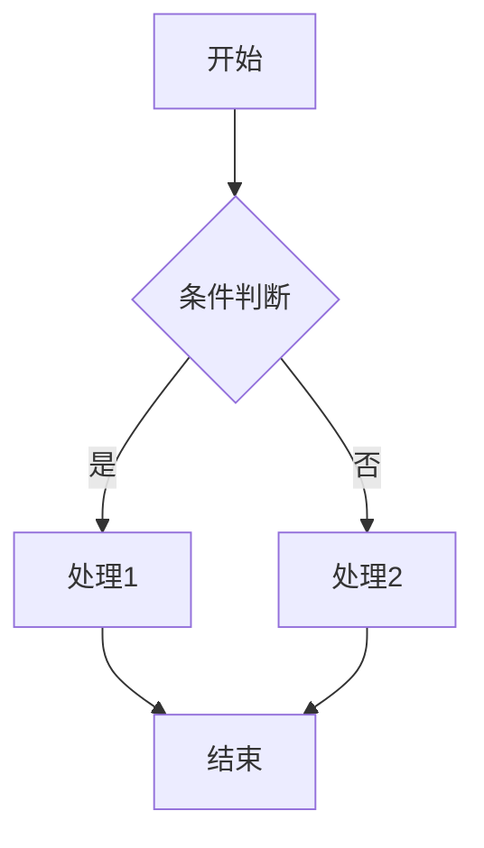
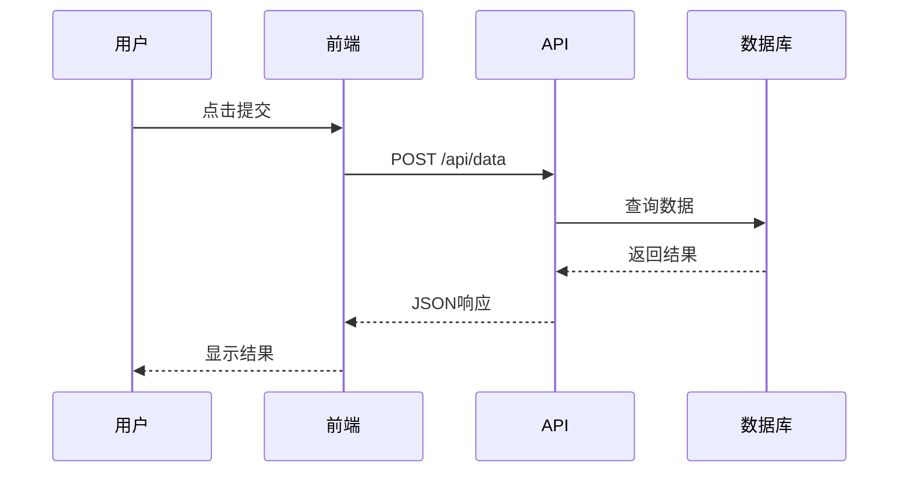

# Markdown 综合测试文档

> 这是一份用于测试Markdown渲染效果的完整文档，涵盖了常见的Markdown语法元素。

---

## 一、文本格式

### 1.1 标题层级

# 一级标题 (H1)
## 二级标题 (H2)
### 三级标题 (H3)
#### 四级标题 (H4)
##### 五级标题 (H5)
###### 六级标题 (H6)

### 1.2 段落与换行

这是第一个段落。Markdown中的段落由一个或多个连续的文本行组成，段落之间用空行分隔。

这是第二个段落。你可以使用**粗体**、*斜体*或***粗斜体***来强调文本内容。

也可以使用~~删除线~~来表示废弃的内容。

### 1.3 行内代码

在行文中使用 `code` 标记来表示代码片段，比如 `console.log("Hello World")` 或 `pip install numpy`。

---

## 二、列表

### 2.1 无序列表

- 第一项
- 第二项
  - 嵌套项 2.1
  - 嵌套项 2.2
    - 更深一层 2.2.1
    - 更深一层 2.2.2
- 第三项
- 第四项

### 2.2 有序列表

1. 第一步
2. 第二步
   1. 子步骤 2.1
   2. 子步骤 2.2
3. 第三步
4. 第四步

### 2.3 混合列表

1. 主要任务
   - 子任务 A
   - 子任务 B
     1. 详细步骤 B1
     2. 详细步骤 B2
   - 子任务 C
2. 次要任务
   - 选项 X
   - 选项 Y
   - 选项 Z

### 2.4 任务列表

- [x] 已完成的项目
- [x] 另一个已完成的项目
- [ ] 待办事项
- [ ] 另一个待办事项
- [ ] ~~取消的任务~~

---

## 三、代码块

### 3.1 普通代码块

```
这是一个没有任何语法高亮的代码块。
可以包含多行文本。
    甚至保留缩进。
```

### 3.2 带语言标识的代码块

**Python 示例：**

```python
def fibonacci(n):
    """生成斐波那契数列"""
    a, b = 0, 1
    for _ in range(n):
        yield a
        a, b = b, a + b

# 使用示例
for num in fibonacci(10):
    print(num)
```

**JavaScript 示例：**

```javascript
// 异步获取数据
async function fetchUserData(userId) {
    try {
        const response = await fetch(`/api/users/${userId}`);
        if (!response.ok) {
            throw new Error(`HTTP error! status: ${response.status}`);
        }
        const data = await response.json();
        return data;
    } catch (error) {
        console.error('获取用户数据失败:', error);
        return null;
    }
}
```

**TypeScript 示例：**

```typescript
interface User {
    id: number;
    name: string;
    email: string;
    isActive: boolean;
}

class UserService {
    private users: User[] = [];

    addUser(user: User): void {
        this.users.push(user);
    }

    getUserById(id: number): User | undefined {
        return this.users.find(u => u.id === id);
    }
}
```

**Bash/Shell 示例：**

```bash
#!/bin/bash

# 备份脚本
BACKUP_DIR="/backup/$(date +%Y%m%d)"
SOURCE_DIR="/home/user/documents"

mkdir -p "$BACKUP_DIR"
tar -czf "$BACKUP_DIR/backup.tar.gz" "$SOURCE_DIR"

echo "备份完成: $BACKUP_DIR/backup.tar.gz"
```

**JSON 示例：**

```json
{
    "name": "markdown-test",
    "version": "1.0.0",
    "description": "A comprehensive markdown test document",
    "author": {
        "name": "Test User",
        "email": "test@example.com"
    },
    "dependencies": {
        "react": "^18.0.0",
        "typescript": "^5.0.0"
    },
    "scripts": {
        "build": "tsc",
        "test": "jest"
    }
}
```

**SQL 示例：**

```sql
SELECT 
    u.id,
    u.username,
    u.email,
    COUNT(o.id) as order_count,
    SUM(o.total_amount) as total_spent
FROM users u
LEFT JOIN orders o ON u.id = o.user_id
WHERE u.created_at >= '2024-01-01'
GROUP BY u.id, u.username, u.email
HAVING COUNT(o.id) > 5
ORDER BY total_spent DESC
LIMIT 10;
```

---

## 四、引用块

### 4.1 简单引用

> 这是一段引用文本。
> 可以有多行。

### 4.2 嵌套引用

> 第一层引用
>> 第二层引用
>>> 第三层引用
>> 回到第二层
> 回到第一层

### 4.3 引用中的其他元素

> ### 引用中的标题
> 
> 引用中可以有**粗体**和*斜体*文本。
> 
> - 也可以有列表项
> - 另一个列表项
> 
> ```
> 甚至可以包含代码块
> ```

---

## 五、表格

### 5.1 基础表格

| 姓名 | 年龄 | 职业 | 城市 |
|------|------|------|------|
| 张三 | 28 | 工程师 | 北京 |
| 李四 | 32 | 设计师 | 上海 |
| 王五 | 25 | 学生 | 广州 |
| 赵六 | 30 | 产品经理 | 深圳 |

### 5.2 对齐方式

| 左对齐 | 居中对齐 | 右对齐 |
|:-------|:--------:|-------:|
| 数据1 | 数据2 | 100.00 |
| 数据A | 数据B | 250.50 |
| 短 | 中等长度 | 9999.99 |

### 5.3 复杂表格

| 功能模块 | 描述 | 状态 | 优先级 | 预计完成时间 |
|:---------|:-----|:----:|:------:|-------------:|
| 用户认证 | 实现JWT token验证机制 | ✅ | 高 | 2024-03-15 |
| 数据库设计 | 完成ER图和表结构设计 | ✅ | 高 | 2024-03-10 |
| API开发 | RESTful接口开发 | 🔄 | 中 | 2024-04-01 |
| 前端界面 | React组件开发 | ⏳ | 中 | 2024-04-15 |
| 单元测试 | 覆盖率>80% | ⏳ | 低 | 2024-05-01 |

---

## 六、链接与图片

### 6.1 行内链接

访问 [GitHub](https://github.com) 或 [OpenAI](https://openai.com) 了解更多信息。

### 6.2 引用式链接

这里有一个 [Markdown指南][1] 和一个 [GitHub][2] 链接。

[1]: https://www.markdownguide.org "Markdown Guide"
[2]: https://github.com "GitHub"

### 6.3 图片


### 6.4 带链接的图片

[](https://github.com)

---

## 七、分隔线

以下是各种风格的分隔线：

---

***

___

- - -

* * *

---

## 八、HTML 嵌入

Markdown 支持嵌入 HTML：

<details>
<summary>点击展开详情</summary>

这是隐藏的内容，可以包含：

- **粗体文本**
- *斜体文本*
- 甚至代码块

```python
print("Hello from details!")
```

</details>

---

## 九、数学公式 (MathJax/KaTeX)

行内公式：$E = mc^2$

块级公式：

$$
\frac{d}{dx}\left( \int_{0}^{x} f(u)\, du \right) = f(x)
$$

矩阵：

$$
\begin{pmatrix}
a & b & c \\
d & e & f \\
g & h & i
\end{pmatrix}
$$

---

## 十、脚注

这是一个需要脚注的句子[^1]。这里是另一个脚注[^2]。

[^1]: 这是第一个脚注的内容。
[^2]: 这是第二个脚注的内容，可以写很长的解释。

---

## 十一、定义列表

术语一
: 这是术语一的定义，可以包含多行内容。

术语二
: 这是术语二的定义。
: 术语二可以有多个定义。

---

## 十二、Emoji 表情

支持的表情符号：

- 🎉 庆祝
- 🚀 火箭
- ⭐ 星星
- 🔥 火焰
- 💡 灯泡
- 📝 笔记
- ✅ 完成
- ❌ 错误
- ⚠️ 警告
- 🐛 Bug

---

## 十三、图表 (Mermaid)





---

## 十四、代码 Diff

```diff
+ 新增的行
- 删除的行
! 修改的行
# 注释
  未变更的行
```

---

## 总结

这份文档涵盖了 Markdown 的主要语法特性：

1. ✅ 标题与段落
2. ✅ 文本格式化（粗体、斜体、删除线、代码）
3. ✅ 列表（有序、无序、任务列表）
4. ✅ 代码块（多种语言高亮）
5. ✅ 引用块
6. ✅ 表格
7. ✅ 链接与图片
8. ✅ 分隔线
9. ✅ HTML 嵌入
10. ✅ 数学公式
11. ✅ 脚注
12. ✅ Emoji
13. ✅ 图表

> **提示**：不同的 Markdown 渲染器对以上特性的支持程度可能有所不同。

---

*文档生成时间：2024年*
*版本：v1.0.0*
